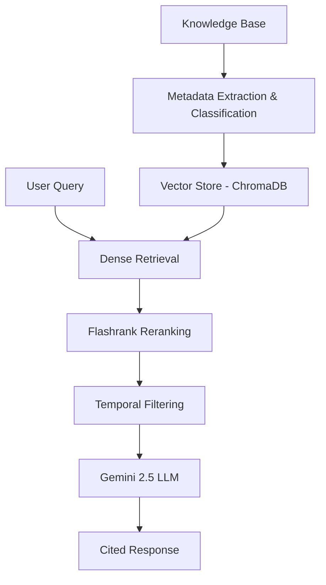

# TechCorp HR Assistant - Conflict-Aware RAG Pipeline

A sophisticated Retrieval-Augmented Generation (RAG) system specifically engineered for TechCorp's HR department. This pipeline handles complex policy scenarios where multiple versions of the same policy may exist, ensuring employees always receive the most up-to-date and accurate information.

## 🌟 Key Features

- **Temporal Conflict Resolution**: Automatically identifies and prioritizes the most recent policy versions based on "Effective Date" metadata, even when older documents are semantically similar.
- **Intelligent Noise Filtering**: Custom classification logic distinguishes between relevant HR policies and irrelevant operational documents (e.g., cafeteria menus).
- **Two-Stage Retrieval Architecture**:
  - **Stage 1 (Dense Retrieval)**: Utilizes `ChromaDB` and `Google Gemini Embeddings` to fetch a broad set of contextually relevant chunks.
  - **Stage 2 (Reranking)**: Employs `Flashrank` to refine and re-order results for maximum precision.
- **Strict Grounding & Citation**: The system is prompted to answer strictly based on the provided context and must provide source citations for every answer.
- **State-of-the-Art LLM**: Powered by `Google Gemini 2.5 Flash Lite` for high-speed, cost-effective, and accurate reasoning.

## 🏗️ Architecture & Workflow

The pipeline follows a structured "Data $\rightarrow$ Retrieval $\rightarrow$ Generation" flow:

1.  **Ingestion**: Documents are loaded from the `knowledge_base/` directory.
2.  **Metadata Extraction**: Each document is parsed to extract effective dates and classify its type (Policy vs. Noise).
3.  **Indexing**: Policy documents are chunked and stored in a persistent `ChromaDB` vector store using Gemini embeddings.
4.  **Retrieval**:
    - A search query triggers a dense retrieval from Chroma.
    - Resulting chunks are passed through a `Flashrank` reranker.
    - A post-retrieval filter applies the temporal logic (latest date wins).
5.  **Generation**: The filtered context is passed to the Gemini LLM with a specialized system prompt for final response synthesis.



## 🛠️ Tech Stack

- **Orchestration**: [LangChain](https://www.langchain.com/)
- **Large Language Model**: `gemini-2.5-flash-lite`
- **Embedding Model**: `models/gemini-embedding-001`
- **Vector Database**: `ChromaDB`
- **Reranker**: `Flashrank`
- **Environment**: Python 3.10+

## 🚀 Getting Started

### Prerequisites

- Python 3.10 or higher
- A Google AI Studio API Key (Get one [here](https://aistudio.google.com/))

### Installation

1.  **Clone the Repository**:
    ```bash
    git clone (https://github.com/vroy651/RagPipeline.git)
    cd RAG
    ```

2.  **Set Up a Virtual Environment**:
    ```bash
    python -m venv venv
    source venv/bin/activate  # On Windows: venv\Scripts\activate
    ```

3.  **Install Dependencies**:
    ```bash
    pip install -r requirements.txt
    ```

4.  **Configure Environment**:
    Create a `.env` file in the root directory:
    ```env
    GOOGLE_API_KEY=your_actual_api_key_here
    ```

### Running the Pipeline

Execute the main script to initialize the knowledge base, index documents, and run a demonstration query:

```bash
python rag_pipeline.py
```

## 📂 Project Structure

- `rag_pipeline.py`: The core application containing the Data Manager, Conflict-Aware Retriever, and RAG Engine.
- `knowledge_base/`: Directory where source text documents are stored (automatically populated with test data on first run).
- `chroma_db/`: Persistent storage for vector embeddings.
- `requirements.txt`: Python package dependencies.
- `.env`: (User Created) Holds the sensitive API keys.

---
*Developed for TechCorp HR Solutions*
